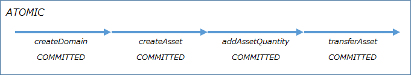
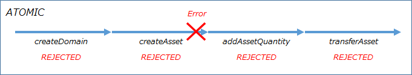
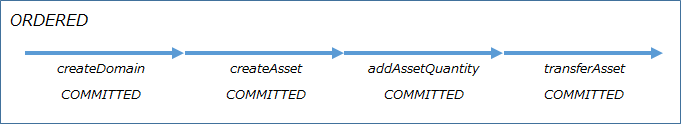
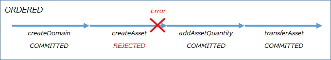

# irohaee-python

## Table of contents
1. [Irohaee - What is python?](#1-irohaee-python-%E3%81%A8%E3%81%AF)
2. Irohaee - python runtime environment 2.1. python version 2.2. availability 2.3. installation instructions[](#2-irohaee-python-%E3%81%AE%E5%8B%95%E4%BD%9C%E7%92%B0%E5%A2%83)  [](#21-python%E3%83%90%E3%83%BC%E3%82%B8%E3%83%A7%E3%83%B3)  [](#22-%E6%8F%90%E4%BE%9B%E5%BD%A2%E6%85%8B)  [](#23-%E3%82%A4%E3%83%B3%E3%82%B9%E3%83%88%E3%83%BC%E3%83%AB%E6%89%8B%E9%A0%86)
3. Irohaee - Overview of python usage 3.1. Initialization[](#3-irohaee-python-%E5%88%A9%E7%94%A8%E6%96%B9%E6%B3%95%E3%81%AE%E6%A6%82%E8%A6%81)  [](#33-%E5%88%9D%E6%9C%9F%E5%8C%96)
4. Irohaee - python usage details 4.1. command 4.2. query 4.3. batch 4.4. exception[](#4-irohaee-python-%E5%88%A9%E7%94%A8%E6%96%B9%E6%B3%95%E3%81%AE%E8%A9%B3%E7%B4%B0)  [](#41-%E3%82%B3%E3%83%9E%E3%83%B3%E3%83%89)  [](#42-%E3%82%AF%E3%82%A8%E3%83%AA)  [](#43-%E3%83%90%E3%83%83%E3%83%81)  [](#44-%E4%BE%8B%E5%A4%96)
5. Appendix 5.1. Transactions[](#5-%E4%BB%98%E9%8C%B2)  [](#51-%E3%83%88%E3%83%A9%E3%83%B3%E3%82%B6%E3%82%AF%E3%82%B7%E3%83%A7%E3%83%B3)

## 1. irohaee - What is python?
Irohaee - python is a high-level wrapper around the open source Iroha - python in a more usable form as the Irosha Enterprise Edition, with additional documentation such as function definitions and usage guides.[](https://github.com/hyperledger/iroha-python)****

Irohaee - With python, you can develop without worrying about complex class structures or how to call methods.

## 2. irohaee - python working environment
### 2.1. python version
Python 3.6 or higher. It also uses pip (pip 3) during package installation.  

### 2.2 Form of Delivery
Irohaee - python is provided in the form of whl files. Users can get the irohaee - python whl file provided in the Git repository and make it available by doing a pip installation.

#### 2.2.1. Git Repositories
Get whl file from repository below

```
T.B.D```

### 2.3. Installation Instructions
Execute the following command from the console to install the irohaee package.

```console
$ pip 3 install [retrieved whl file]```

## 3. irohaee - Overview of python usage
### 3.1. Initialization
The API calls take advantage of the IrohaEE class in the irohaee package. The constructor takes the transaction's creator account ID, private key, Iroha server host, and Iroha server port.[][][][]

* If host and port are not set, host "127.0.0.1" and port 50051 are used as default values.

```python
#Import irohaee package from irohaee import * #IrohaEE instantiation example irohaee = IrohaEE (account _ id, private _ key, host, port)```

```python
#Host, defaults if port is unspecified irohaee = IrohaEE (account _ id, private _ key)```

If you want to change the setting, call the following methods to override the setting :.

```python
#Iroha host, configuring port irohaee. setIroha #transaction creator account ID, setting private key irohaee. setAccount (account _ id, private _ key)```

## 4. irohaee - more on python usage
Irohaee - The API provided by python includes commands to do update-related processing and queries to do reference-related processing.

### 4.1. Commands
Examples of command API calls are :.

> For the API reference for the command (arguments, return values, and exceptions), see the "Command" chapter in the attached "Function Definition Document". The createDomain functions in this chapter correspond to the irohaee. createDomain () calls in the code below.

```python
Try : #createDomain (domain generated) API call res = irohaee. createDomain (.) except IrohaEETransactionException as e : #Exception handling```

### 4.2. Queries
An example of a query invocation is :.

> For the query API reference (arguments, return values, and exceptions), see the "Query" chapter in the attached "Function Definition Document". The getAccount function described in that chapter corresponds to irohaee.

Note that in irohaee - python, query return values are returned in tuples. In the following example, the variable res, which contains the return value of irohaee. getAccount (), contains tuples containing the return values from the function definition document : account _ id, domain _ id, quorum, json _ data, and account _ roles.

```python
Try : #getAccount API call res = irohaee. getAccount (.) #get account information from processing results account _ id = res [0] domain _ id = res [1] quorum = res [2] json _ data = res [3] account _ roles = res [4] except IrohaEEQueryException as e : #exception handling```

### 4.3. Batches
Iroha allows you to run multiple transactions as a batch. There are Atomic and Ordered batches in the batch.

> For the batch API reference (arguments, return values, exceptions), see the "Batch" chapter in the attached "Function Definition Document". The createAssetForBatch functions in this chapter correspond to the irohaee. createAssetForBatch () calls in the code below.

#### 4.3.1. Atomic Batch
Atomic batches are recorded in a distributed ledger only if all transactions in the batch have successfully completed the Stateful Validation.

An example of an atomic batch API call is :.

```python
Try : #Uses method chain format res _ list = irohaee. createDomainForBatch (...)\. createAssetForBatch (...)\. addAssetQuantityForBatch (...)\. transferAssetForBatch (...)\ #Atomic batch execution. sendAtomic () except IrohaEEBatchTransactionException as e : #Exception handling```

In the example, createDomain, createAsset, addAssetQuantity, and transferAsset are executed in an atomic batch. If createAsset fails as shown below, all transactions will fail.





#### 4.3.2. Ordered Batch
Ordered batches are recorded in a distributed ledger only if the Stateful Validation succeeds. (Even if some transactions fail, the entire batch does not fail.)

An example of an Ordered batch API call is :.

```python
Try : #Uses method chain form res _ list = irohaee. createDomainForBatch (...)\. createAssetForBatch (...)\. addAssetQuantityForBatch (...)\. transferAssetForBatch (...)\ #Ordered batch run. sendBatch () except IrohaEEBatchTransactionException as e : #Exception handling```

The example runs createDomain, createAsset, addAssetQuantity, and transferAsset in an Ordered batch. Even if createAsset fails as shown below, other transactions with no problems will succeed.





### 4.4. Exceptions
Irohaee - python throws an exception if the transaction fails when calling the API.

The following exceptions correspond to API types :.

| Type | Occurrence exception |
| :------------- | :------------------------------- |
| On command failure | IrohaEETransactionException |
| On query failure | IrohaEEQueryException |
| On batch failure | IrohaEEBatchTransactionException |

#### 4.4.1 Command Failure
If the command API fails, IrohaEETransactionException is thrown, and on success, transaction hash (tx _ hash) and transaction status (status) tuples are returned. The correspondence between the transaction state and the return value is as follows.

> See Section 5.1 Transactions for more information about transaction states.[](#51-%E3%83%88%E3%83%A9%E3%83%B3%E3%82%B6%E3%82%AF%E3%82%B7%E3%83%A7%E3%83%B3)

| Transaction state | Status | Return value |
| :-------------------------- | :--- | :-------------------------------- |
| COMMITTED | Success | (tx_hash, status) |
| MST_PENDING | Hold | (tx_hash, status) |
| STATELESS_VALIDATION_FAILED | Failure | IrohaEETransactionException occurs |
| REJECTED | Failure | IrohaEETransactionException occurs |

- IrohaEETransactionException thrown on failure includes STATEFUL error code, transaction hash, and transaction state

- The STATEFUL error code is set when the transaction state is REJECTED and the cause is STATEFUL _ VALIDATION _ FAILED

- MST _ PENDING is set when a multisignature transaction has not reached the requested number of signed (= Quorum) transactions

> For the values that can be retrieved from the thrown IrohaEETransactionException, see the exceptions listed in the Command chapter of the Function Definition Document.


#### 4.4.2 Query Failure
If the query API fails, a IrohaEEQueryException is thrown ; on success, a tuple containing a response based on the API definition is returned.

| Status | Return value |
| :--- | :----------------------------- |
| Success | Return tuple based on API definition |
| Failure | IrohaEEQueryException occurs |

The IrohaEEQueryException thrown on failure includes the STATEFUL error code and the ErrorResponse object.

> See the exceptions listed in the Query chapter of the Function Definition Book for possible values from the thrown IrohaEEQueryException.

#### 4.4.3 Batch Failure
IrohaEEBatchTransactionException is thrown if the batch API fails, and an array of transaction hash (tx _ hash) and transaction status (status) tuples is returned on success.

| Status | Return value |
| :--- | :------------------------------------- |
| Success | Array of (tx _ hash, status) |
| Failure | IrohaEEBatchTransactionException occurs |

The IrohaEEBatchTransactionException thrown on failure includes a transaction hash and an array of transaction states.

> For the values that can be retrieved from a thrown IrohaEEBatchTransactionException, see the exceptions listed in the Batch chapter of the Function Definition Book.


## 5. Appendix
### 5.1. Transactions
A transaction sent from a client changes state depending on the validation results and signature state.


#### 5.1.1. Process Overview
1. Client requests are received by Torii.
2. Stateless Validation is performed first, followed by signing and formal validation.
3. A Stateful Validation is performed to verify the execution authority, balance, and so on.
4. Committed blocks are recorded as a block chain.

#### 5.1.2 Transaction State

| Transaction state | Description |
| :--------------------------- | :--------------------------------------------------------- |
| NOT_RECEIVED | The requested peer does not have information about this transaction |
| ENOUGH_SIGNATURES_COLLECTED | Multisignature transactions get enough signatures |
| MST_PENDING | Multisignature transactions require additional signatures |
| MST_EXPIRED | Multisignature transactions disabled and removed |
| STATELESS_VALIDATION_FAILED | Stateless Validation Failed |
| STATELESS_VALIDATION_SUCCESS | Stateless Validation Successful |
| STATEFUL_VALIDATION_FAILED | Stateful validation failed |
| STATEFUL_VALIDATION_SUCCESS | Stateful Validation Successful |
| COMMITTED | Win enough votes and store in block store |
| REJECTED | Transaction denied during stateful validation |


Of these states, the final status of a transaction (sent from a non-malicious node) is either STATELESS _ VALIDATION _ FAILED, COMMITTED, or REJECTED.

Irohaee - In python, returns either "COMMITTED" or "MST _ PENDING" as the state of the transaction upon successful completion.

If the state of the transaction at the time of the abnormal termination is "STATELESS _ VARIDATION _ FAILED" or "REJECTED", it is considered a transaction failure and throws an exception.

See 4.4 Exceptions for exceptions.[](#44-%E4%BE%8B%E5%A4%96)

For more information about transaction state transitions, see the following URL :.
> #### Transaction Statuses
> https://iroha.readthedocs.io/en/latest/before_start/glossary.html#transaction-statuses
> #### Status Streaming In Hyperledger Iroha
> https://medium.com/iroha-contributors/status-streaming-in-hl-iroha-5503487ffcfds

### 5.1.3 Configuring Transactions
Iroha transactions consist of Payload and Signatures.

#### Payload

| Element | Description |
| :----------------------------------- | :---------------------------------------------------------- |
| Command | Iroha API commands |
| Creation time | Creation time (UNIX time in milliseconds) |
| Account ID of the transaction creator | Account name @ domain format |
| Quorum | Number of signatures required (default : 1) |
| Batch meta information (optional) | Batch information (ATOMIC, ORDERED), transaction reduction hash |

#### Signatures

| Element | Description |
| :--- | :----------------------------------- |
| Signature | Transaction Creator / Approver Signature |

#### Transaction definition
```protobuf
message Transaction { message Payload { message BatchMeta{ enum BatchType{ ATOMIC = 0; ORDERED = 1; } BatchType type = 1; // array of reduced hashes of all txs from the batch repeated string reduced_hashes = 2; } message ReducedPayload{ repeated Command commands = 1; string creator_account_id = 2; uint64 created_time = 3; uint32 quorum = 4; } // transcation fields ReducedPayload reduced_payload = 1; // batch meta fields if tx belong to any batch oneof optional_batch_meta{ BatchMeta batch = 5; } } Payload payload = 1; repeated Signature signatures = 2; }```

### 5.1.4 Multisignature Transactions
Multisignature transactions are transactions that require multiple signatures, and the number of signatures required is specified in quorum.

The following code example adds a signature to a multi-signature transaction.
```python
#Import IrohaCrypto from Iroha import IrohaCrypto```
```python
#private _ keys = [' f101537e319568c765b2cc89698325604991dca57b9716b58016b253506caba1',' f101537e319568c765b2cc89698325604991dca57b9716b58016b253506caba2']```
```python
Try : #get transaction pending _ response = irohaee. getPendingTransactions (1, null) transactions = pending _ response [0] #add signature for tx in transactions : IrohaCrypto. sign _ transaction (tx, * private _ keys) #send transaction irohaee. irohaGrpc. send _ txs (transactions) #print transaction send result for status in irohaee. irohaGrpc. tx _ status _ stream (transactions) : print (status) except IrohaEETransactionException as e : #exception handling```
